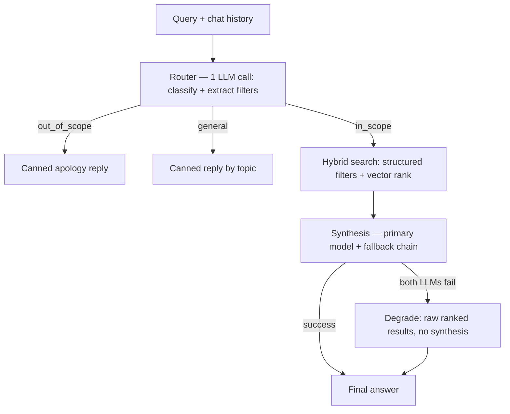

# Estatio AI Assistant — Architecture

Status: trial deployment, free-tier infrastructure. Last reviewed 2026-10-02.

## 1. Request flow



Design principles behind this flow:
- **Router runs first and cheap.** Deterministic regex guards catch obvious out-of-scope messages (programming questions, food/restaurants) before spending any LLM call. A second deterministic path extracts filters from common Arabic property-query patterns without an LLM call at all; the LLM router is the fallback for anything less templated.
- **Fail closed, not open.** If every router LLM call fails, the request is classified `out_of_scope` rather than falling through to an unrestricted property search.
- **General questions never hit an LLM.** A static lookup table (identity / capabilities / how_to_find / valuation / other) answers these at zero token cost.
- **Synthesis degrades gracefully.** If both the primary and fallback synthesis models fail, the response falls back to the raw ranked candidates instead of erroring — this applies the same way regardless of the query's language.

## 2. Hybrid search

One Postgres RPC, `match_properties`, does the whole job:

1. **Structured filters are hard constraints** — city, budget, property type, rooms are applied as SQL `WHERE` clauses, not learned signal.
2. **Vector similarity ranks within that filtered set** — cosine distance against `property_vectors.embedding`, not used to decide inclusion.

This is deliberate: exact-match attributes (price ceiling, room count) are better enforced by SQL than hoped for from embedding proximity. The vector space is reserved for what's genuinely fuzzy — view, floor type, building/phase, furnishing feel, neighbourhood character.

```sql
-- simplified shape
match_properties(query_embedding, p_city, p_budget, p_type, p_rooms, match_count)
  → candidates from property_vectors ORDER BY embedding <=> query_embedding LIMIT 100
  → JOIN property_features
  → WHERE city/budget/type/rooms match
  → ORDER BY distance LIMIT match_count
```

## 3. Embeddings

- **Model:** `nvidia/nemotron-3-embed-1b`, native output is 2048 dimensions. The API does **not** support a `dimensions` request parameter — truncation has to happen client-side.
- **Asymmetric input types matter.** Indexing uses `input_type="passage"`; querying uses `input_type="query"`. Getting this wrong is NVIDIA's own documented cause of large retrieval-accuracy drops.
- **Stored at 1024 dims.** Truncate-then-L2-normalize (in that order) from the native 2048 output. Validated empirically against 200 queries: mean overlap@10 ≈ 0.89 vs the full 2048-dim result, worst case 0.50. (512 dims was tested and rejected — 0.82 mean, 0.40 worst case, not safe for user-facing search.)
- **Stored as `halfvec(1024)`**, not `vector(1024)` — half-precision floats, pgvector 0.8.2+. Roughly halves storage again with negligible recall impact.
- **ivfflat index** (`halfvec_cosine_ops`, lists=100) on `property_vectors.embedding`. Without it, a similarity query over ~41k rows took 13.5s — unusable for a chat response. With it: ~100ms.

### Document construction (what gets embedded)
Bilingual per property: an Arabic segment (raw listing title + extracted unit signals — floor type, view, building, phase, furnishing, completion status) plus an English structured summary (type, rooms, baths, area, location, status, price, price/m² vs neighbourhood average). The URL is deliberately **not** embedded — it's pure token noise with no semantic value; it's joined in from `property_features` at serve time instead.

## 4. Data layout — two separate Supabase projects

| | `efounder` (property data) | `estatio-accounts` (identity) |
|---|---|---|
| Holds | `bronze_listings` → `silver_listings` → `properties`/`property_features`/`property_vectors`, `match_properties` RPC | `auth.users`, `profiles`, `favorites`, `chat_messages` |
| Why separate | Public read-heavy data vs. private user data — isolates PII from the publicly-queried listing data; avoids one dataset's growth threatening the other's free-tier budget | |
| Trade-off | No real foreign key between `favorites.property_id` and a property — it's a plain int. Any "my favourite properties" view requires two queries (accounts DB for the IDs, property DB for details) joined in application code, not in SQL | |

Each project is on Supabase's free tier: 500MB database, 2 free projects per organization, unlimited API requests (the real free-tier constraint is 5GB/month egress, not request count). A third free project isn't available on the same account — further headroom means upgrading one project to Pro ($25/mo, 8GB) rather than adding more free projects (multiple accounts to dodge the cap isn't something we're doing — that risks the account being flagged against Supabase's ToS).

## 5. Security model (RLS)

Two policy conventions, applied consistently across both projects:
- **Public-read tables** (`properties`, `property_features`, `listings`, `price_history`, `property_vectors`, etc.): RLS on, `SELECT` granted to `anon` + `authenticated`, `USING (true)`. Writes are never granted to these roles — only the backend (`service_role`, which bypasses RLS entirely) writes.
- **Backend-only / private tables** (`bronze_listings`, `silver_listings`, `pipeline_runs`, `buildings`, `alembic_version`, `chat_messages`): RLS on, **no policy at all** for `anon`/`authenticated` — deny-by-default. `chat_messages` specifically is never queried from the browser; the assistant server function reads/writes it with `service_role` and is responsible for verifying whose session it's touching.
- `profiles`: `SELECT` restricted to `auth.uid() = id`. `favorites`: full CRUD restricted to `auth.uid() = user_id`.
- Function `search_path` is pinned on every `SECURITY DEFINER`/RPC function (search_path hijacking is a real attack surface on Postgres functions).
- The `vector` extension lives in its own `extensions` schema, not `public`.

## 6. LLM orchestration

**Framework: Vercel AI SDK (`ai` package)**, not LangGraph — deliberately. This flow is close to linear (router → search → synthesis), not a complex multi-agent graph, and the AI SDK keeps the implementation to a handful of files instead of LangGraph's node/edge scaffolding. (The team's other project, a Telegram hiring bot, does use LangGraph.js in Python — that one has a genuinely branchy agent loop that justifies the graph abstraction. Different flow shape, different tool.)

- `generateObject` + Zod schemas (`RouterOutputSchema`, `SynthesisOutputSchema`) for structured LLM output — no manual JSON parsing on the happy path.
- Provider chain: **OpenRouter Free Router** (`openrouter/free`, primary) → **Groq GPT-OSS 120B** (fallback) → **NVIDIA Llama 3.2 11B via raw JSON parsing** (last resort, used when structured-output mode isn't available through that provider).
- Both router and synthesis follow the same chain-and-degrade shape.

### File structure (4 files, intentionally)
```
assistant.server.ts   — orchestration: validates input, runs router, branches, saves history
assistant.schemas.ts  — Zod schemas (request/response, router output, synthesis output)
assistant.llm.ts      — provider config, prompts, embedding generation
assistant.db.ts       — two Supabase clients (property + accounts), RPC calls, chat persistence
```

## 7. Rate limiting

Upstash Ratelimit, sliding window, 20 requests/minute, keyed by `x-forwarded-for` (falls back to a shared `"anonymous"` bucket only if that header is missing — fine behind any standard reverse proxy/CDN).

## 8. Deployment

Currently a free-tier trial end to end: Supabase free (×2 projects), free LLM tiers (OpenRouter free router/Groq/NVIDIA), no paid compute yet. Deployment target is still an open decision:
- **Cloudflare Workers** — matches the existing Estatio frontend deployment, zero additional infra, but needs verifying the AI SDK and Supabase client run cleanly on Workers (may need `nodejs_compat`).
- **Docker** (Dockerfile / docker-compose already prepared) — portable to Google Cloud Run's always-free tier for the trial, or any VPS later.

Plan if the trial succeeds: upgrade Supabase to Pro and/or move to a dedicated server, rather than working around free-tier limits indefinitely.

## 9. Known-fixed issues (2026-10-02 review)

| Issue | Impact | Status |
|---|---|---|
| Query embeddings sent at full 2048 dims instead of truncated 1024 | `match_properties` RPC errored on every call → silently returned zero results for every in-scope query | Fixed |
| Router-extracted filters discarded in two places (`assistant.server.ts` and `assistant.db.ts`) | Hybrid search was pure vector search, no structured filtering | Fixed |
| Successful Arabic synthesis discarded in favour of a static template | LLM-generated explanations never reached Arabic-speaking users (the majority) | Fixed |
| Structured SQL fallback commented out, hard `return []` in its place | No degradation path when the vector RPC failed | Restored |
| Stale migration documented a different schema (`properties.embedding`) and granted `anon`/`authenticated` write access to `chat_messages` | Re-running it would both break search and reopen a fixed security hole | Replaced with a migration matching the live schema |

## 10. Open items

- `app/api/admin/embed-properties/route.ts` — a second, TypeScript-side embedding pipeline writing to a different column (`property_features.embedding`) than the real pipeline (`property_vectors`, via the Python `store.py`). Conflicting and likely dead; pending a decision to remove it.
- The old `20260927_init_assistant.sql` migration should be deleted from the repo once the replacement is confirmed working, so it can't be re-run by accident.
- `match_properties`'s signature doesn't yet expose `minArea` / `finishingStatus`, which the router already extracts from Arabic queries — needs either a signature extension or a documented decision to ignore them for now.
- Cloudflare vs. Docker deployment target.
- The property-matching pipeline (`match_method`) regressed once already (41k → 121k properties, 0% real matches) and was fixed; the next scheduled scrape run is the real confirmation that the fix holds.
