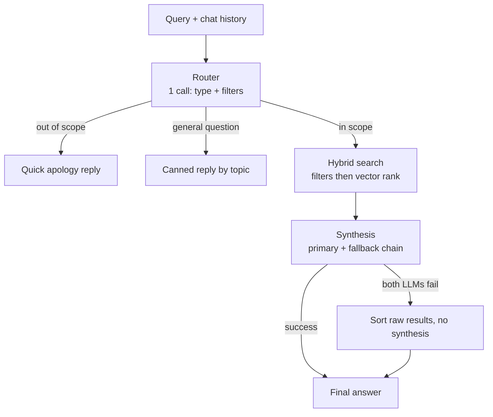

# Estatio AI Property Assistant Microservice

Production-lean AI Property Assistant for the **Estatio** Egyptian real estate platform.

## 1. Architecture Flow



- **Router Fail-Safe**: If router throws or times out, it defaults to `in_scope` with `{}` filters so queries are never dropped.
- **Degradation Path**: If all LLM tiers (Groq -> OpenRouter Llama 3.3 70B free -> NVIDIA) fail synthesis, the service formats the closest raw DB matches directly without throwing.
- **Zero Token Burn for General Queries**: Uses a canned lookup table for questions like *"Who are you?"*, *"What can you do?"*, or *"How do I find listings?"*.

## 2. Data layer — two separate Supabase projects

| | `efounder` (property data) | `estatio-accounts` (identity) |
| :--- | :--- | :--- |
| Holds | `property_vectors`, `property_features`, `match_properties` RPC, scraping pipeline tables | `auth.users`, `profiles`, `favorites`, `chat_messages` |
| Why | Keeps public listing data and private user/chat data on separate free-tier budgets, and isolates PII from publicly-queried data | |

There is **no** `chat_messages` table in `efounder` — it lives only in `estatio-accounts`, locked to `service_role` (no `anon`/`authenticated` RLS policy). `favorites.property_id` has no real foreign key, since the property lives in a different project; joining a user's favourites to property details happens in application code across two queries, not in SQL. See `ARCHITECTURE.md` for the full picture.

## 3. File Layout

```
estatio_chatbot/
├── src/
│   ├── lib/
│   │   ├── assistant.server.ts   # Core orchestration: router branching, synthesis & fallbacks
│   │   ├── assistant.schemas.ts  # Zod validation schemas (RouterOutput, ListingFilters, ChatRequest)
│   │   ├── assistant.llm.ts      # Vercel AI SDK config; Groq -> OpenRouter (llama-3.3-70b-instruct:free) -> NVIDIA chain
│   │   └── assistant.db.ts       # Supabase client: hybrid RPC, structured fallback, chat history
│   └── server.ts                 # Express HTTP API server (:3000)
├── supabase/
│   └── migrations/
│       ├── 20260927_init_assistant.sql.DEPRECATED.md  # do not run — stale schema, kept for history
│       ├── 20260928_accounts_chat.sql   # estatio-accounts: auth, profiles, favorites, chat_messages
│       └── 20261002_align_with_live_schema.sql  # efounder: property_vectors, match_properties (run this one)
├── Dockerfile
├── docker-compose.yml
├── .env.example
├── package.json
└── tsconfig.json
```

## 3. Quick Start

### Install Dependencies
```bash
npm install
```

### Configure Environment Variables
Copy `.env.example` to `.env` and fill in:
```bash
cp .env.example .env
```

| Variable | Description |
| :--- | :--- |
| `SUPABASE_URL` | **efounder** project URL (property data) |
| `SUPABASE_SERVICE_ROLE_KEY` | **efounder** service role secret |
| `ACCOUNTS_SUPABASE_URL` | **estatio-accounts** project URL (auth, favorites, chat history) |
| `ACCOUNTS_SUPABASE_SERVICE_ROLE_KEY` | **estatio-accounts** service role secret |
| `OPENROUTER_API_KEY` | OpenRouter API key, used with model id `meta-llama/llama-3.3-70b-instruct:free` (second-tier router/synthesis backup, between Groq and NVIDIA; free key at openrouter.ai) |
| `GROQ_API_KEY` | Groq Cloud API key (Llama 3.3 70B, fallback synthesis model) |
| `NVIDIA_API_KEY` | NVIDIA API Catalog key for `nvidia/nemotron-3-embed-1b`. Native output is 2048 dims; the app truncates client-side to the first 1024 dims (re-normalized) to match `property_vectors.embedding halfvec(1024)` — the API itself has no `dimensions` parameter |
| `UPSTASH_REDIS_REST_URL` | (Optional) Upstash Redis endpoint for edge rate limiting |
| `UPSTASH_REDIS_REST_TOKEN` | (Optional) Upstash token |
| `PORT` | Service port (default `3000`) |

### Run Locally (Dev)
```bash
npm run dev
```

### Build & Run (Production)
```bash
npm run build
npm start
```

### Docker
```bash
docker build -t estatio-assistant .
docker run --env-file .env -p 3000:3000 estatio-assistant
```

## 4. API Endpoints

### `POST /api/chat`
**Request:**
```json
{
  "message": "Find me a 3-bedroom apartment in New Cairo under 6 million EGP",
  "sessionId": "user_session_123",
  "history": [
    { "role": "user", "content": "Hi" },
    { "role": "assistant", "content": "Hello! How can I help you today?" }
  ]
}
```

**Response:**
```json
{
  "text": "I found 3 great apartments in New Cairo matching your budget...",
  "propertyIds": [12, 45, 89],
  "type": "in_scope",
  "filters": {
    "city": "New Cairo",
    "budget": 6000000,
    "property_type": "Apartment",
    "rooms": 3
  },
  "sessionId": "user_session_123"
}
```

### `GET /health`
Returns health check status and service uptime.
